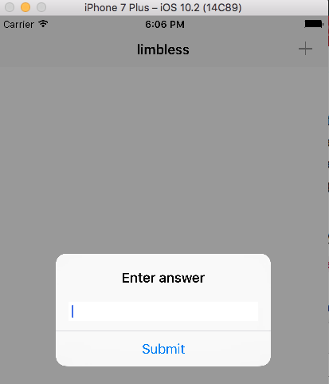
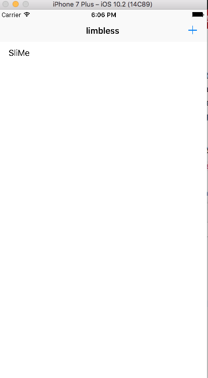
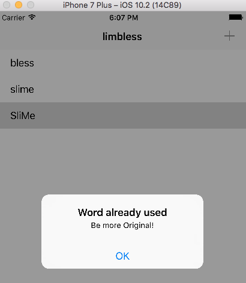
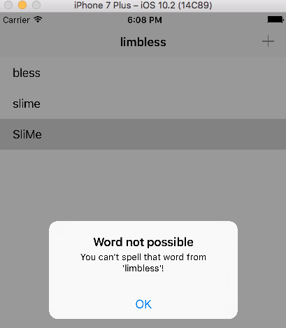

# WordScramble

A simple anagram game app that asks the user to make anagrams of words provided. The app provides user feedback when input is completed by the user. 

### Screenshots of the Word Scramble App

                         Above: Screenshot of the "Main" screen of the Word Scramble app

                         Above: Screenshot of the user responses pop-ups in the Word Scramble app

                         Above: Screenshot of the feedback to the user pop-up in the Word Scramble app

Code Source: Hacking with Swift - https://www.hackingwithswift.com

